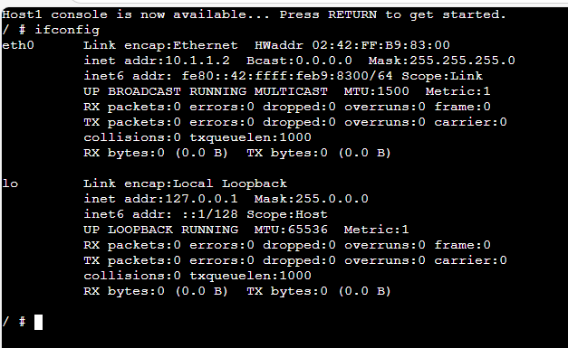

# Week 01: Introduction to Networking
## Task 1: Introduction to GNS3 Basics

## Introduction
GNS3 (Graphical Network Simulator-3) is a network simulation tool used to design, test, and learn computer networking concepts in a virtual environment. It allows users to create network topologies using routers, switches, and hosts without needing physical hardware. This makes it useful for students and network engineers to practice configuration and troubleshooting skills.

## Purpose of the Task
The purpose of this task was to become familiar with the basic features of GNS3, including project creation, adding devices, assigning IP addresses, starting and stopping nodes, and using the console to run Linux networking commands.


## Outputs

1. GNS3 File \
[GNS3-Intro](GNS3_files/GNS-Intro-12312316.gns3project) 

2. Screenshot of Network \
 

3. Screenshot of console showing IP Address \

 


## Testing Results
- Successfully created a new GNS3 project with the required naming format.
- Added one Linux Host node to the workspace.
- Added annotations showing project title, name, student ID, and date.
- Configured a static IP address on `eth0` using the `/etc/network/interfaces` file.
- Started the node without errors.
- Opened the web console successfully.
- Verified the assigned IP address using the command:

```bash
ifconfig


## Reflections

This week helped me understand the basic use of GNS3 and how virtual networks can be created without physical devices. I learned how to add nodes, configure devices, and use annotations to make the topology clear and organised. Configuring a static IP address in Linux gave me practical experience with basic networking commands and files. At first, navigating the GNS3 interface was new to me, but after completing the task I became more confident using the software.

## Notes on Key Concepts Learned

#GNS3

GNS3 is a network simulation platform that allows users to build and test network topologies using virtual devices.

Static IP Address

A static IP address is manually assigned to a device and remains the same until changed by the user.

Network Interface

eth0 is the first Ethernet interface on the Linux Host used for network communication.

Subnet Mask

The subnet mask defines the network and host portion of an IP address. Example: 255.255.255.0 for a /24 network.

IP Forwarding

IP forwarding allows a device to route packets between interfaces. It is usually disabled on hosts and enabled on routers.


## Learnings
How to create and save a project in GNS3
How to add and start a Linux Host node
How to configure a static IP address
How to use the Linux console in a browser
How to verify configuration using commands

