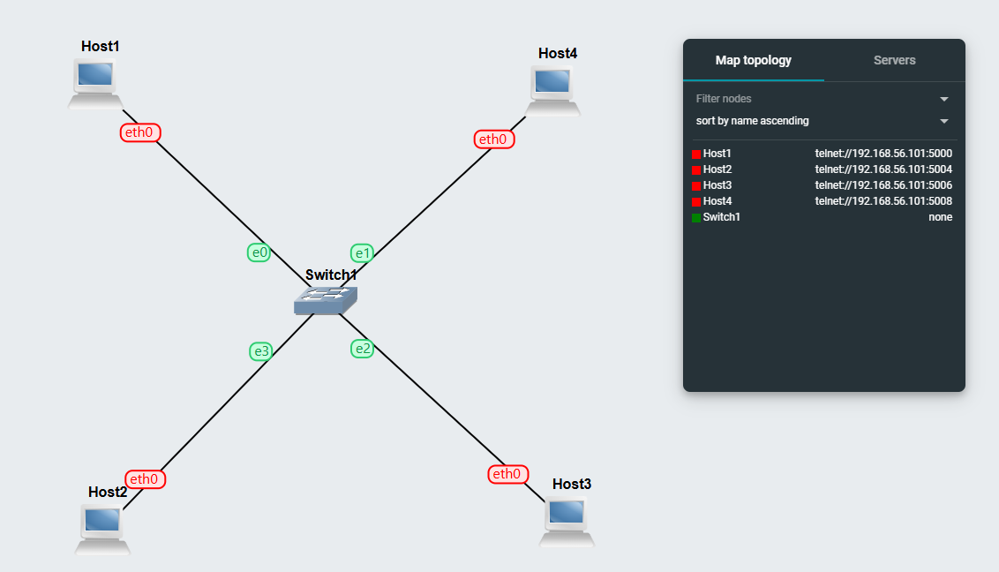
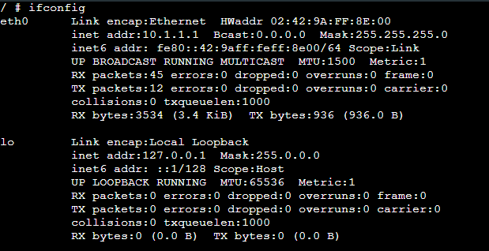
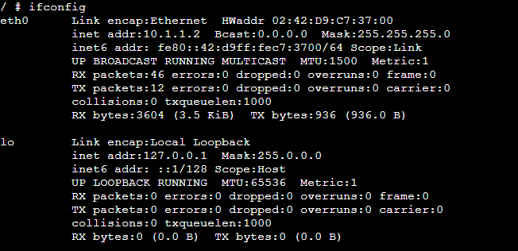
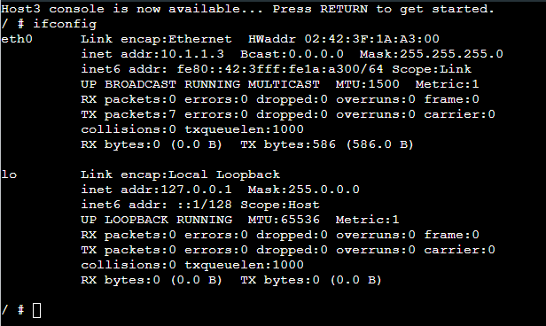
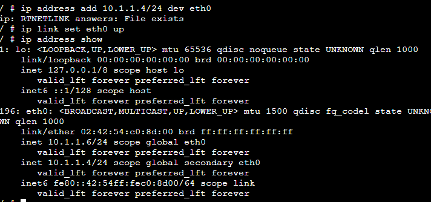
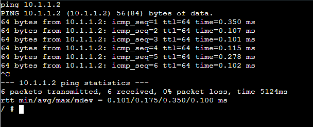
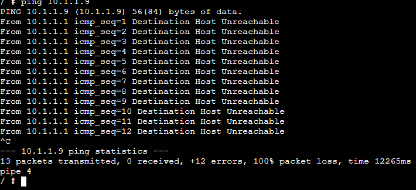
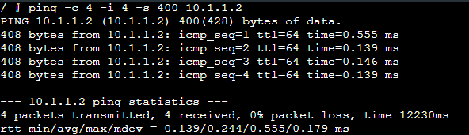

# Week 02: Encapsulation and Decapsulation

# Theory

## Static IP Addressing
A static IP address is a manually assigned address that does not change automatically. It is useful in network labs because each host keeps the same address, making testing and troubleshooting easier. In this task, different Linux hosts were configured with static IP addresses using multiple methods.

## Methods of Assigning IP Addresses

### 1. Using GNS3 Configure Menu
The GNS3 Configure menu allows users to assign IP settings before starting the node. These settings are stored in the device configuration and are automatically applied when the node boots. This is the easiest method for beginners.

### 2. Using /etc/network/interfaces
The `/etc/network/interfaces` file is a Linux configuration file used to permanently assign network settings. By editing this file and restarting the interface with `ifdown` and `ifup`, the host can use a static IP address. This method is useful because the configuration remains after reboot.

## Task 1: Setting Static IP Addresses
## Outputs

1. GNS3 File \
[GNS3-Setting IP](GNS3_files/Setting-IP-12312316.gns3project)

2. Network Diagram \

3. IP Address of Hosts 

**Host 1** \
 

**Host 2** \
 

**Host 3** 

The IP is assigned via console.

 

**Host 4** 

The IP for Host4 is assigned using command from console ( *ip address add <ipaddress>/<mask> dev eth0* ) \

 

## Task 2: Testing Network Connectivity and Delay with Ping

## Outputs

1. Ping command output \

2. Ping command and output to a wrong IP \

3. Ping command (and output) when limiting the count, setting the data size and interval to non-default values kept all together.

With all options \

