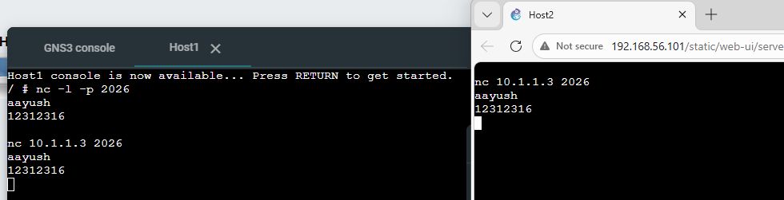

# Week 03: The TCP and IP Protocols

## Task 1: Simple Application Communications with Netcat
## Outputs
Netcat Client and Netcat Server \

## Task 2: Capturing Packets

## Outputs

PCAP File for Ping and Netcat Capture \
[Packet-Capture](images/Capture-basics-12312316-ping-netcat)

