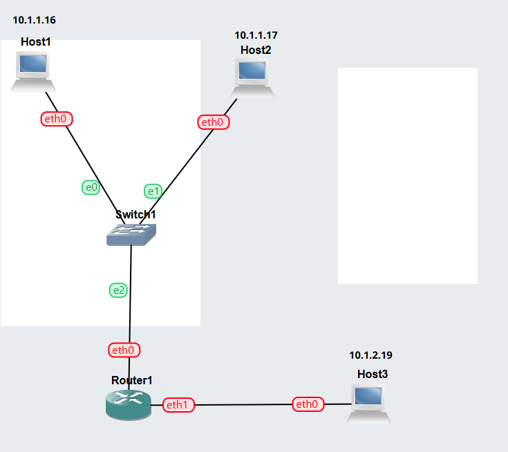
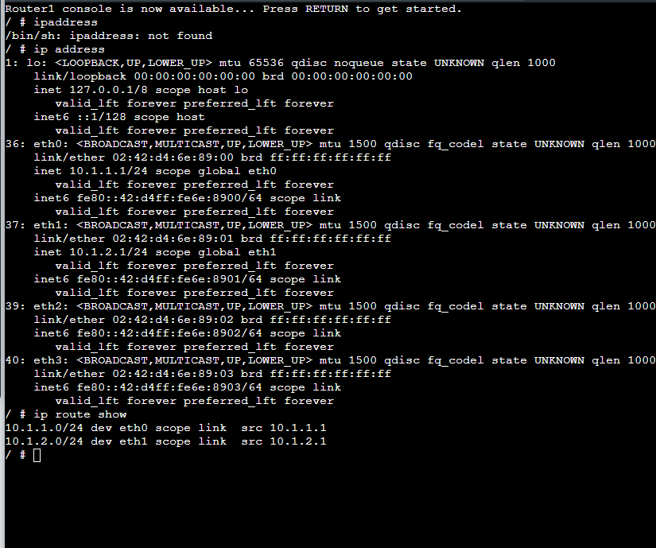
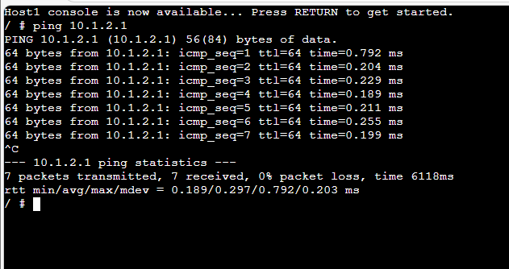
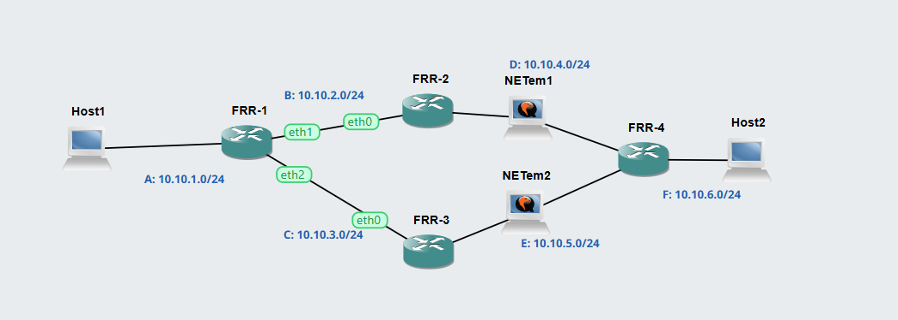
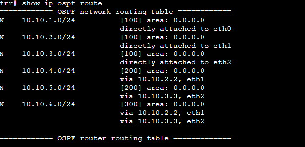
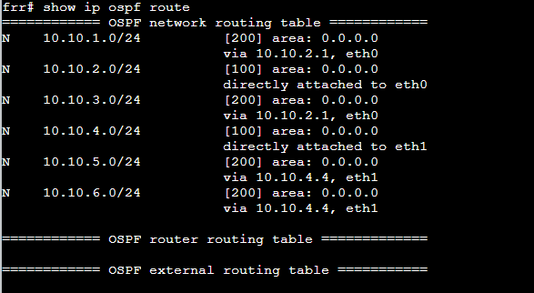
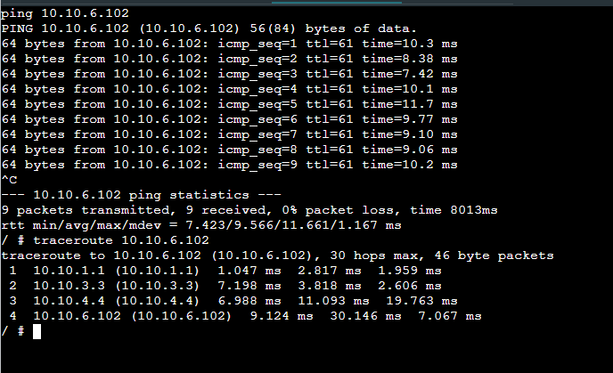
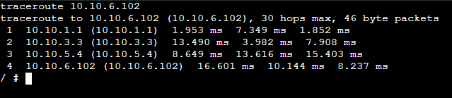

# Week 04: Routing
# Task 1: View Routing Tables  
1. GNS3 Project file      
[GNS3 File](GNS3_files/View-Route-12312316.gns3project)   

2. Network Diagram   

3. Record of IP Routes   
   
  

4. Ping to other network       
   

## Task 2: Dynamic Routing with OSPF

## Outputs

1. GNS3 File demonstrating OSPF    
[GNS3-SPFile](GNS3_files/OSPF-Basics-12312316.gns3project)   

2. Network Diagram demonstrating OSPF     
   

 

4. Routing table for two routers       
     
    

   

# OSPF Verification Commands and Routing Summary

# Routing Summary Table for All Routers

## 1. show ip ospf neighbor

## FRR-1
| Destination | Next Node |
|------------|-----------|
| 10.10.1.0/24 | Direct |
| 10.10.2.0/24 | Direct |
| 10.10.3.0/24 | Direct |
| 10.10.4.0/24 | FRR-2 |
| 10.10.5.0/24 | FRR-3 |
| 10.10.6.0/24 | FRR-2 |

## FRR-2
| Destination | Next Node |
|------------|-----------|
| 10.10.2.0/24 | Direct |
| 10.10.4.0/24 | Direct |
| 10.10.1.0/24 | FRR-1 |
| 10.10.3.0/24 | FRR-1 |
| 10.10.5.0/24 | FRR-4 |
| 10.10.6.0/24 | FRR-4 |

## FRR-3
| Destination | Next Node |
|------------|-----------|
| 10.10.3.0/24 | Direct |
| 10.10.5.0/24 | Direct |
| 10.10.1.0/24 | FRR-1 |
| 10.10.2.0/24 | FRR-1 |
| 10.10.4.0/24 | FRR-4 |
| 10.10.6.0/24 | FRR-4 |

## FRR-4
| Destination | Next Node |
|------------|-----------|
| 10.10.4.0/24 | Direct |
| 10.10.5.0/24 | Direct |
| 10.10.6.0/24 | Direct |
| 10.10.1.0/24 | FRR-2 |
| 10.10.2.0/24 | FRR-2 |
| 10.10.3.0/24 | FRR-3 |

6. Traceroute Command Output    
* Without stopping NETem 1     
   

* Stopping NETem 1     
   

