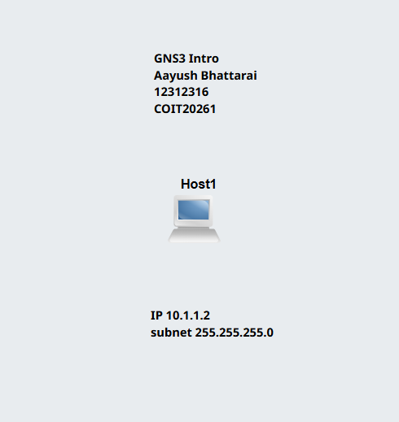

# Week 05: Switching and VLAN
## Task 1: Setup VLANs on Switch
## Outputs

1. GNS3 project

   
[Vlan-basics](Vlan-basics-12312316.gns3project)

2. Screenshot of Network \

2. Screenshot of Ports and Tags \
 
