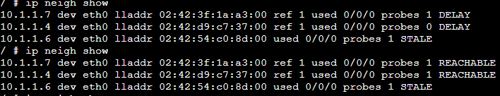
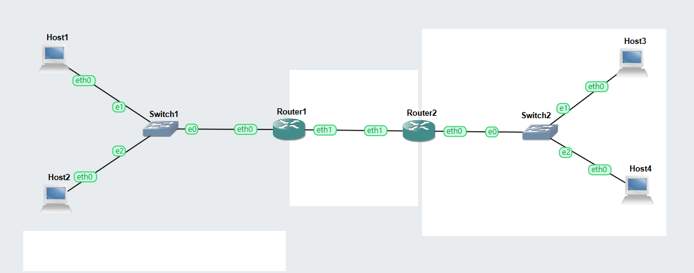
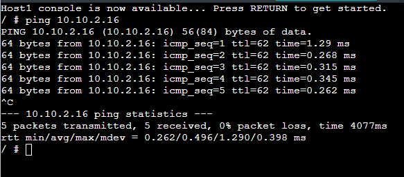

# Week 06: Address Resolution and Management

## Task 1: Resolving IP Addresses to Hardware Addresses

## Testing Results

### Task 1: Resolving IP Addresses to Hardware Addresses

- Opened Host A console and displayed the ARP table using:

                    ip neigh show

Initially, the ARP table had few or no dynamic entries.

Pinged Host B from Host A successfully.

Checked the ARP table again and observed a new mapping between Host B’s IP address and MAC address with state such as REACHABLE.

Pinged Host A from Host C.

Viewed Host A ARP table again and observed additional neighbour entries.

Confirmed that ARP entries changed as devices communicated.

## Outputs    

1. Host1 ARP    
   

## Task 2: Default Gateways

## Testing Results

Created a topology with four Linux Hosts, two Linux Routers, and two Ethernet switches across three subnets.

Configured static IP addresses on all devices.

Added default gateways on hosts using /etc/network/interfaces.

Enabled IP forwarding on routers and disabled forwarding on hosts.

Verified routing tables using:

                ip route show
                
Successfully pinged between hosts on different subnets through the routers.

## Outputs  
1. GNS3 VLAN File       
   

2. Network Diagram    
   

3. Ports and Tags    
Interface Details

| Device   | Interface | IP Address     | Subnet Mask     | Network     |
|----------|-----------|----------------|------------------|-------------|
| Host1    | eth0      | 10.1.1.16      | 255.255.255.0    | 10.1.1.0/24 |
| Host2    | eth0      | 10.1.1.17      | 255.255.255.0    | 10.1.1.0/24 |
| Router1  | eth0      | 10.1.1.1       | 255.255.255.0    | 10.1.1.0/24 |
| Router1  | eth1      | 10.1.3.16      | 255.255.255.0    | 10.1.3.0/24 |
| Router2  | eth0      | 10.1.2.1       | 255.255.255.0    | 10.1.2.0/24 |
| Router2  | eth1      | 10.1.3.17      | 255.255.255.0    | 10.1.3.0/24 |
| Host3    | eth0      | 10.1.2.16      | 255.255.255.0    | 10.1.2.0/24 |
| Host4    | eth0      | 10.1.2.17      | 255.255.255.0    | 10.1.2.0/24 |    

Route Details     
| Device   | Destination     | Next Hop         | Interface |
|----------|------------------|------------------|-----------|
| Router1  | 10.1.1.0/24      | directly connected | eth0 |
| Router1  | 10.1.3.0/24      | directly connected | eth1 |
| Router1  | 10.1.2.0/24      | 10.1.3.17          | eth1 |
| Router2  | 10.1.2.0/24      | directly connected | eth0 |
| Router2  | 10.1.3.0/24      | directly connected | eth1 |
| Router2  | 10.1.1.0/24      | 10.1.3.16          | eth1 |    

4. Ping to Other Network

   

## Reflections

This week helped me understand how devices communicate inside a LAN using MAC addresses as well as IP addresses. I learned that ARP automatically resolves an IP address into a hardware address before packets can be sent on the local network. It was interesting to observe how ARP tables update dynamically after communication. The default gateway task also showed me how hosts rely on routers to reach remote networks. These practical exercises improved my understanding of both local and inter-network communication.

## Notes on Key Concepts Learned

### ARP

  ARP (Address Resolution Protocol) is used to map an IP address to a MAC address on a local network.

### ARP Table

  An ARP table stores known IP-to-MAC address mappings for neighbouring devices.

### MAC Address

  A MAC address is the physical hardware address of a network interface card used for communication in a LAN.

### Neighbour State

  States such as REACHABLE, STALE, or DELAY indicate the current status of ARP entries.

### Default Gateway

  A default gateway is the router used by a host to send traffic to networks outside its local subnet.

### Routing Table

  A routing table contains destinations, gateways, and interfaces used to forward packets.

## Learnings

How ARP resolves IP addresses to MAC addresses

How to view and interpret ARP tables

How neighbour entries change over time

Importance of MAC addresses in local communication

How default gateways allow hosts to reach remote networks

How to verify routing tables

Difference between local delivery and routed delivery
